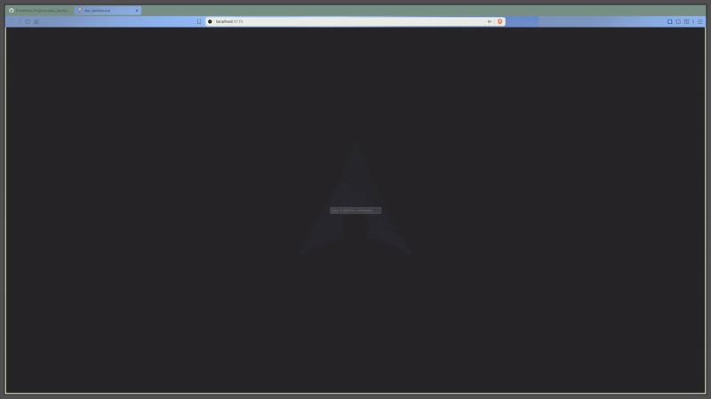

# Prize Picks Projects

> This is a collection of front end projects to show I can progress in front end

## My first prototype gif:

This first prototype functions without needing to press any button

### Simple React App

This is my simple application that is more of a sandbox
It is there for me to practice and test

- useState
- useEffect
- Classic TypeScript
